<div align="center">
  <a href="http://netflix-clone-with-tmdb-using-react-mui.vercel.app/">
    
  </a>

  <h3 align="center">Netflix Clone</h3>

  <p align="center">
    <a href="https://netflix-clone-react-typescript.vercel.app/">View Demo</a>
    ·
    <a href="https://github.com/crazy-man22/netflix-clone-react-typescript/issues">Report Bug</a>
    ·
    <a href="https://github.com/crazy-man22/netflix-clone-react-typescript/issues">Request Feature</a>
  </p>
</div>

<details>
  <summary>Table of Contents</summary>
  <ol>
    <li>
      <a href="#prerequests">Prerequests</a>
    </li>
    <li>
      <a href="#which-features-this-project-deals-with">Which features this project deals with</a>
    </li>
    <li><a href="#third-party-libraries-used-except-for-react-and-rtk">Third Party libraries used except for React and RTK</a></li>
    <li>
      <a href="#contact">Contact</a>
    </li>
  </ol>
</details>

<br />

<div align="center">
  
  <p align="center">Home Page</p>
  
  <p align="center">Mini Portal</p>
  
  <p align="center">Detail Modal</p>
  
  <p align="center">Grid Genre Page</p>
  
  <p align="center">Watch Page with customer contol bar</p>
</div>

## Prerequests

- Create an account if you don't have on [TMDB](https://www.themoviedb.org/).
  Because I use its free API to consume movie/tv data.
- And then follow the [documentation](https://developers.themoviedb.org/3/getting-started/introduction) to create API Key
- Finally, if you use v3 of TMDB API, create a file named `.env`, and copy and paste the content of `.env.example`.
  And then paste the API Key you just created.

## Which features this project deal with

- How to create and use [Custom Hooks](https://reactjs.org/docs/hooks-custom.html)
- How to use [Context](https://reactjs.org/docs/context.html) and its provider
- How to use lazy and Suspense for [Code-Splitting](https://reactjs.org/docs/code-splitting.html)
- How to use a new [lazy](https://reactrouter.com/en/main/route/lazy) feature of react-router to reduce bundle size.
- How to use data [loader](https://reactrouter.com/en/main/route/loader) of react-router, and how to use redux dispatch in the loader to fetch data before rendering component.
- How to use [Portal](https://reactjs.org/docs/portals.html)
- How to use [Fowarding Refs](https://reactjs.org/docs/forwarding-refs.html) to make components reusuable
- How to create and use [HOC](https://reactjs.org/docs/higher-order-components.html)
- How to customize default theme of [MUI](https://mui.com/)
- How to use [RTK](https://redux-toolkit.js.org/introduction/getting-started)
- How to use [RTK Query](https://redux-toolkit.js.org/rtk-query/overview)
- How to customize default classname of [MUI](https://mui.com/material-ui/experimental-api/classname-generator)
- Infinite Scrolling(using [Intersection Observer API](https://developer.mozilla.org/en-US/docs/Web/API/Intersection_Observer_API))
- How to make awesome carousel using [slick-carousel](https://react-slick.neostack.com)

## Third Party libraries used except for React and RTK

- [react-router-dom@v6.9](https://reactrouter.com/en/main)
- [MUI(Material UI)](https://mui.com/)
- [framer-motion](https://www.framer.com/docs/)
- [video.js](https://videojs.com)
- [react-slick](https://react-slick.neostack.com/)

## Install with Docker

```sh
docker build --build-arg TMDB_V3_API_KEY=your_api_key_here -t netflix-clone .

docker run --name netflix-clone-website --rm -d -p 80:80 netflix-clone
```

## Todo

- Make the animation of video card portal more similar to Netflix.
- Improve performance. I am using `context` and `provider` but all components subscribed to the context's value are re-rendered. These re-renders happen even if the part of the value is not used in render of the component. there are [several ways](https://blog.axlight.com/posts/4-options-to-prevent-extra-rerenders-with-react-context/) to prevent the re-renders from these behaviours. In addition to them, there may be several performance issues.
- Replace bundler([Vite](https://vitejs.dev/guide)) with [Turbopack](https://turbo.build/pack/docs/why-turbopack). Turbopack is introduced in Next.js conf recently. It's very fast but it's nor ready to use right now. it just support Next.js, and they plan to support all others as soon as possible. so if it's ready to use, replace [Vite](https://vitejs.dev/guide) with [Turbopack](https://turbo.build/pack/docs/why-turbopack).
- Add accessibilities for better UX.
- Add Tests.


# HOW TO RUN THIS PROJECT
Hands-on DevOps Project-04 Netflix application

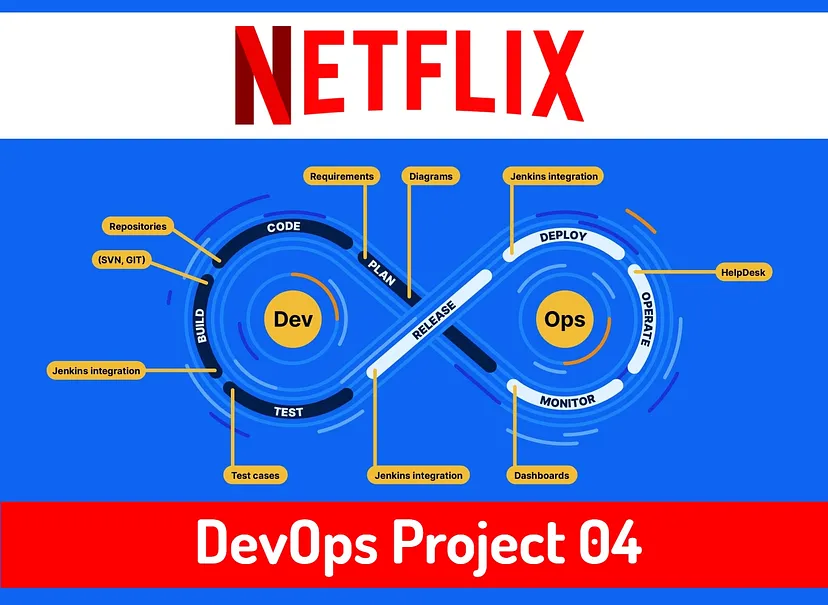
# Hello everyone I am back with another Project of DevOps😉

Project Overview:

Our project centers around creating a Netflix clone web application and deploying it on a Kubernetes cluster. We will containerize the web application and its dependencies using Docker images. These Docker images will enable us to encapsulate the application and ensure consistent behavior across various environments.

In the fast-paced world of technology, containerization has revolutionized the way applications are developed, deployed, and managed. One of the most popular container orchestration platforms is Kubernetes, known for its ability to effortlessly handle containerized applications at scale.

Understanding Kubernetes:

Kubernetes, often abbreviated as K8s, is an open-source container orchestration platform that automates the deployment, scaling, and management of containerized applications.

It abstracts the underlying infrastructure and provides a unified API to manage clusters of containers effectively. With Kubernetes, developers can focus on building applications without worrying about the complexities of deployment and scaling.

Let’s start…


# Step 01:- Basic Requirement
  * Go to AWS console and provision one Instance.
  * Netflix-Project — (AMI- Ubuntu 22.04, Type- t2.medium)
  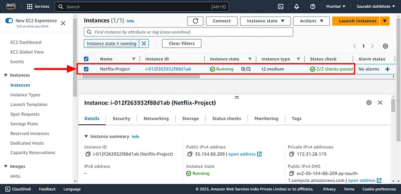

  * Install updates. (sudo apt-get update)
  * Install Docker. [Installation steps Click Here](https://docs.docker.com/engine/install/ubuntu/)
  * Give permission to Docker (sudo usermod -aG docker $USER && newgrp docker)
  * Minikube and Kubectl installation [Click Here for installation](https://www.linuxtechi.com/how-to-install-minikube-on-ubuntu/)
  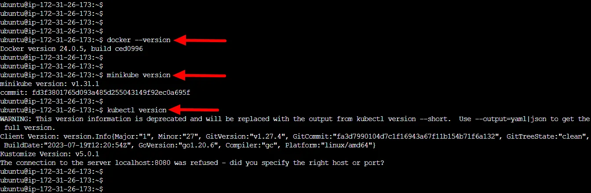

# Step:02- Push Docker image to Docker-Hub
  * Get Netflix app code from GitHub and clone in the EC2 instance. [Click Here for repository link](https://github.com/SaurabhDahibhate/netflix-clone-react-app)
  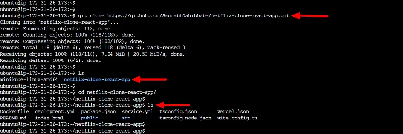
  * Make sure you have already written the docker file.
  * Docker file for Netflix-app
  ```Dockerfile
  FROM node:16.17.0-alpine as builder
  WORKDIR /app
  COPY ./package.json .
  COPY ./yarn.lock .
  RUN yarn install
  COPY . .
  ARG TMDB_V3_API_KEY
  ENV VITE_APP_TMDB_V3_API_KEY=${TMDB_V3_API_KEY}
  ENV VITE_APP_API_ENDPOINT_URL="https://api.themoviedb.org/3"
  RUN yarn build

  FROM nginx:stable-alpine
  WORKDIR /usr/share/nginx/html
  RUN rm -rf ./*
  COPY --from=builder /app/dist .
  EXPOSE 80
  ENTRYPOINT ["nginx", "-g", "daemon off;"]
  ```

  ```bash
  docker image build -t netflix-clone .
  ```
  * Create an image out of docker file and create and run the container out of it.
  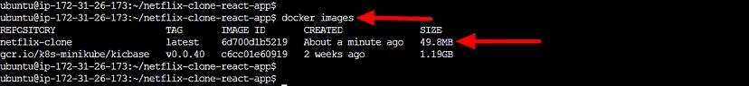

  * Create docker hub account if you don’t have. Make repository on docker-hub
  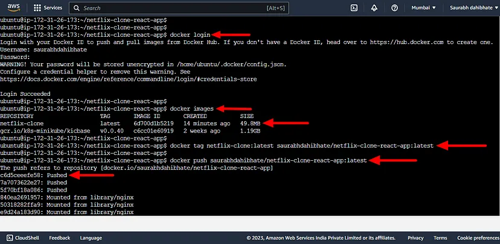

# Step:03 — Create Deployment and Service.yaml files for Deployments
  * Now, create the deployment yaml file.
  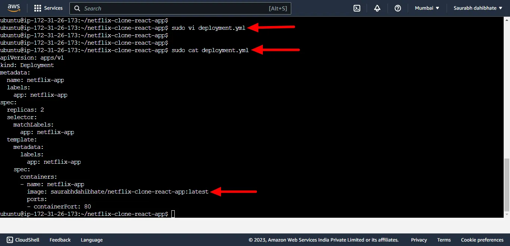

  * Run and check the successful running of deployment in the instance.
  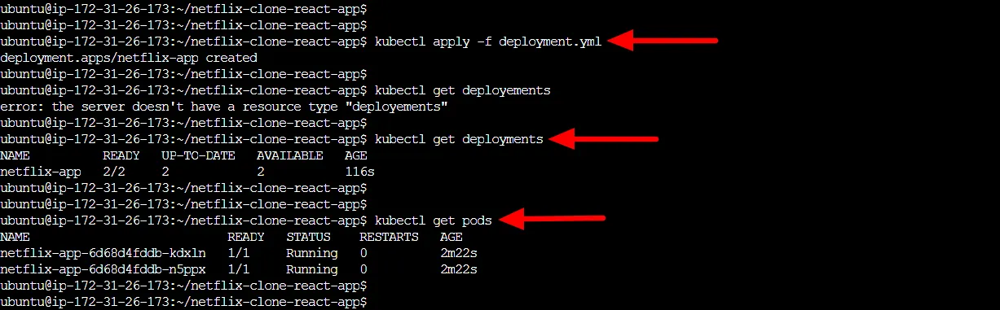

  * Create a service.yaml file to connect the node port and access the url from the outside world.
  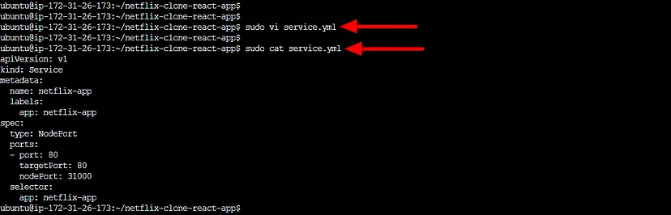

  * Get the URL and curl it to check the website accessibility.
  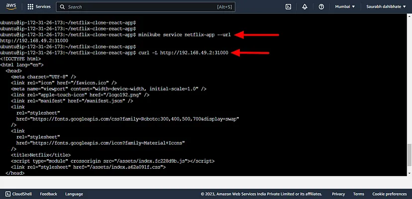

  * Check with Public URL and we can now see the Netflix APP running on the server.
  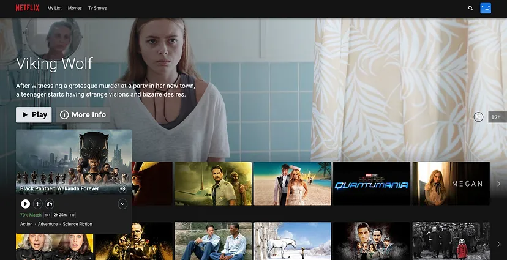